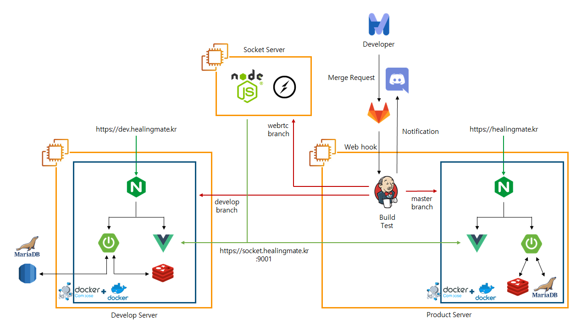

## HealingMate란?

##### 공통의 관심사를 나누거나 속 깊은 고민을 이야기 할 힐링메이트를 찾아주는 모바일 웹 서비스

## 🚢팀 소개

|   Name   | 이동규                              | 김순석                              | 김윤빈                              | 서범석                              | 이아영                              |
| :------: | ----------------------------------- | ----------------------------------- | ----------------------------------- | ----------------------------------- | ----------------------------------- |
| Profile  |  |  |  |  |  |
| Position | 팀장<br />프론트엔드                | 팀원 <br />프론트엔드               | 팀원 <br />프론트엔드               | 팀원 <br />백엔드                   | 팀원<br />백엔드<br />인프라        |

## 📖Index

- [Architecture](#archiecture)
- [Tech Stack](#tech-stack)
- [User Manual](#user-manual)
- [Feature](#feature)
- [Wireframe](#wireframe)

## 📌Architecture



## 📌Tech Stack

### Back-End

#### 기술스택


-10.4.13-61DAFB?Style=flat&logo=MariaDB&logoColor=61DAFB)

#### 사용된 라이브러리


---

### Front-End

#### 기술스택


#### 사용된 라이브러리


---

### 인프라

#### 기술스택


#### 📚사용된 플러그인  ----------------------


## 📌User Manual

#### Back-End

1. 다음 형식으로 ./backend/build/resources/application.yaml 경로로 application.yaml 파일 작성

   ```yaml
      server:
        port: 8080
        servlet:
          context-path: /api
      
      spring:
        datasource:
          driverClassName: org.mariadb.jdbc.Driver
          url: < Database URL >
          username: < Database ID >
          password: < Database Password >
        jpa:
          hibernate:
            ddl-auto: update
        servlet:
          multipart:
            max-file-size: 20MB
            max-request-size: 20MB
        cache:
          type: redis
        redis:
          host: < Redis URL >
          port: < Redis Port >
          password: < Redis Password >
      
      springdoc:
        version: '1.0.0'
        api-docs:
          path: /api-docs
        default-consumes-media-type: application/json
        default-produces-media-type: application/json
        swagger-ui:
          operations-sorter: method
          tags-sorter: alpha
          path: /swagger-ui.html
          disable-swagger-default-url: true
          display-query-params-without-oauth2: true
      
      app:
        token:
          authorizationHeader: authorization
          bearerPrefix: Bearer
        auth:
          tokenSecret: < Token Secret 문자열 >
          AccessTokenExpirationMsec: < Access Token 기간 (밀리초단위) >
          RefreshTokenExpirationMsec: < Refresh Token 기간 (밀리초단위)>
      
      file:
        path: < image 파일 경로 >
   ```

   

2. ```bash
   cd ./backend
   gradlew clean build
   java -jar {생성된jar파일이름}
   ```

#### Front-End

1. ```bash
   cd ./frontend
   npm install
   npm run serve
   ```

#### Socket Server

1. server.js에서 다음을 수정해준다.

   ```javascript
   var PORT = 9001;
   var isUseHTTPs = true; //-> false로 변경
   ```

2. config.js에서 사용할 포트 번호 및 키 파일 경로 등을 설정해준다.

   ("./keys/privkey1.pem"와 "./keys/fullchain1.pem"는 fake-key의 경로로 그대로 사용하셔도 무방합니다)

   ```json
   {
     "socketURL": "/",
     "dirPath": "",
     "homePage": "/demos/index.html",
     "socketMessageEvent": "RTCMultiConnection-Message",
     "socketCustomEvent": "RTCMultiConnection-Custom-Message",
     "port": "8282", //----------------------> 사용할 포트 번호
     "enableLogs": "false",
     "autoRebootServerOnFailure": "false",
     "isUseHTTPs": "false",
     "sslKey": "./keys/privkey1.pem",// -----> key 파일 경로
     "sslCert": "./keys/fullchain1.pem",// --> key 파일 경로
     "sslCabundle": "",
     "enableAdmin": "true",
     "adminUserName": "username",
     "adminPassword": "password"
   }
   ```

3. `npm install`을 이용하여 필요한 라이브러리를 설치해준다.
4. `server.js`가 있는 위치로 이동하여 `node server`을 이용하여 실행한다.

## 📌Feature

### 주요기능

#### 회원관리

- TODO

#### 게시글 CRUD

- TODO

#### 메타버스

- TODO

#### 유저 매칭

- TODO


## 📌Wireframe

<iframe height='600' scrolling='no' title='Fancy Animated SVG Menu' src='https://www.figma.com/embed?embed_host=astra&url=
       https://www.figma.com/file/01wdPw8RgH4z8GYIRU4pDY/HealingMate?node-id=0%3A1' frameborder='no' allowtransparency='true' allowfullscreen='true' style='width: 100%;'>
</iframe>
[*힐링메이트 와이어 프레임 바로가기*](https://www.figma.com/file/01wdPw8RgH4z8GYIRU4pDY/HealingMate?node-id=0%3A1)

